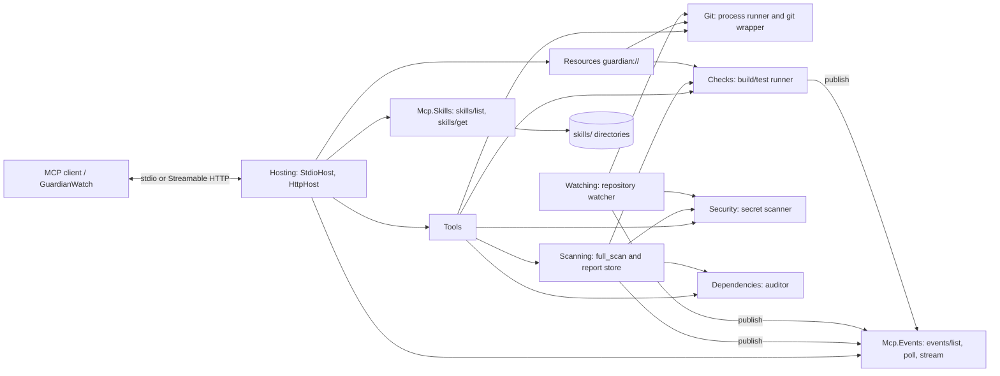

# Proactive Codebase Guardian

> An MCP server that turns AI agents into **reactive and proactive** software engineering assistants.

**Codebase Guardian** watches a Git repository, pushes events the moment something important happens, and gives the agent
structured **Agent Skills** and tools. The agent can then review commits, triage failing checks, respond to leaked secrets and
keep dependencies healthy without constant polling or a human prompting each step.

Every event that has a natural follow-up names a **suggested skill**. A skill is a packaged workflow that the agent loads
(`skills/get` + `resources/read`, verified against a SHA-256 digest) and then carries out with the Guardian's tools.

It is built on the Model Context Protocol revision, the MCP C# SDK 2.2.0 and .NET 10:

- **MCP Events**: `events/list`, `events/poll`, and `events/stream` push delivery
- **Skills extension** (`io.modelcontextprotocol/skills`, SEP-2640)
- **Tools** and **Resources**, with the **Tasks** extension (`io.modelcontextprotocol/tasks`) for long-running scans
- **Stateless request/response core**: stdio and stateless Streamable HTTP

> **Status:** Feature complete for v1 (see [docs/backlog](docs/backlog/README.md)). The design is in
> [docs/specs/2026-10-04-codebase-guardian-design.md](docs/specs/2026-10-04-codebase-guardian-design.md).

---

## Why this is useful

Traditional AI coding assistants are **reactive**: they act only when a human asks. Engineering teams need assistants that
**notice** problems and start on them.

| Problem | How Codebase Guardian solves it |
|---|---|
| Agents have to keep polling for new commits, failing checks or leaked secrets | **MCP Events**: the server pushes a notification over `events/stream` when something changes. Clients without Events use the `poll_events` tool with the same semantics |
| Complex workflows (security audit, bug triage, dependency upgrades) are hard to prompt reliably | Ships five ready-to-use **Agent Skills** that encode the procedure step by step and name the exact tools and resources to use |
| An event alone does not say what to do next | Each event carries a `suggestedSkill` URI, so the agent knows which workflow to load |
| Skill content could be tampered with in transit | Every skill file is listed with its size and SHA-256 digest, so clients can verify what they load |
| Long-running analysis blocks the conversation | The **Tasks** extension: `full_scan` (and, optionally, `run_checks` and `audit_dependencies`) return a task handle instead of blocking |
| Scaling MCP servers used to require sticky sessions | Built on the **stateless ** protocol: request/response methods need no session affinity |
| Every team reinvents the same "watch this repo" logic | One reusable MCP server that any MCP client can connect to |

**What it does today:**

- When a commit lands, the agent is told (`repo.commit.created`) and can review it with the `pr-review` skill.
- When a commit contains something that looks like a credential, `security.secret_detected` fires with redacted findings, and
  the `security-audit` skill walks through revoke, rotate and clean-up.
- When a dependency manifest changes, the `dependency-hygiene` skill audits for vulnerable and outdated packages.
- When the build or tests fail (`checks.failed`), the `bug-triage` skill reads the stored log, reproduces the failure and
  isolates the commit that caused it.
- When a `full_scan` finishes (`scan.completed`), the event links the Markdown report and names the skill to load next.
- With a GitHub token, new issues, PR comments and failed CI runs arrive as events, and the agent can file an issue, comment on
  a PR or open a pull request from an already pushed branch. Every outward-facing action asks for confirmation first.

This is the difference between an AI that answers questions and an AI that **helps run the engineering process**.

---

## Features

### Protocol surface

| MCP feature | How the Guardian uses it |
|---|---|
| Tools | Inspect the repository, summarize diffs, run checks, scan for secrets, audit dependencies, `full_scan`, GitHub actions, `poll_events` fallback |
| Resources | `guardian://` live repo status, recent commits, check runs and logs, scan reports; `skill://` skill files |
| Skills (`io.modelcontextprotocol/skills`) | `skills/list`, `skills/get`, `resources/directory/read`; five bundled skills |
| Tasks (`io.modelcontextprotocol/tasks`) | `full_scan` always runs as a task; `run_checks` and `audit_dependencies` may |
| Events (Triggers & Events, **draft**) | `events/list`, `events/poll`, `events/stream`, `events/subscribe` (webhooks, authenticated HTTP only) |
| Stateless core | stdio and stateless Streamable HTTP |

### Bundled skills

| Skill | Use it for | Triggered by |
|---|---|---|
| `guardian` | Load first: what the server watches, how to subscribe, the event-to-skill map, safety rules | — |
| `security-audit` | Triage secret findings by rule, confirm with `scan_secrets`, revoke/rotate first, rewrite history only with consent | `security.secret_detected` |
| `dependency-hygiene` | Run `audit_dependencies`, fix critical/high vulnerabilities first, major vs minor upgrade policy, verify with `run_checks` | `repo.dependencies.changed` |
| `bug-triage` | Read the check log, reproduce, isolate with `recent_commits` and `diff_summary`, classify, write an issue report | `checks.failed` |
| `pr-review` | Review a commit's diff against a checklist covering correctness, tests, security, naming and docs | `repo.commit.created` |

New skills are a directory with a `SKILL.md`; point `--skills-dir` at your own directories to add them.

### Modern MCP support

- Latest Protocol version, verified with the official MCP conformance suite: all three Skills scenarios pass (see
  [docs/reference/conformance.md](docs/reference/conformance.md)).
- stdio and stateless Streamable HTTP transports.
- Works with any MCP client, for example Claude Code or VS Code. Clients that do not implement the draft `events/*` methods
  get the same events through the `poll_events` tool.

## Quick start

Requires the .NET SDK 10.0 and `git` on the PATH.

```bash
dotnet build
dotnet run --project src/CodebaseGuardian -- --repo .
```

The server speaks MCP on stdio (stdout is reserved for the protocol; logs go to stderr). Options:

| Option | Meaning |
|---|---|
| `--repo <path>` | Repository to watch (default: current directory) |
| `--transport stdio\|http` | Transport (default `stdio`) |
| `--urls <url>` | HTTP listen address (default `http://127.0.0.1:5199`) |
| `--auto-checks` | Run the configured checks after each new commit |
| `--no-watch` | Disable the repository watcher (no pushed events) |
| `--skills-dir <path>` | Skill directories (default: `skills` next to the binary) |

Every option is also a `Guardian:*` setting (appsettings, `GUARDIAN__*` environment variables).

## Configuring clients

**Claude Code**

```bash
claude mcp add codebase-guardian -- dotnet run --project <path>/src/CodebaseGuardian -- --repo <repo>
```

**VS Code** (`.vscode/mcp.json`)

```json
{
  "servers": {
    "codebase-guardian": {
      "type": "stdio",
      "command": "dotnet",
      "args": ["run", "--project", "<path>/src/CodebaseGuardian", "--", "--repo", "${workspaceFolder}"]
    }
  }
}
```

**HTTP mode** (stateless Streamable HTTP, endpoint `/mcp`)

```bash
dotnet run --project src/CodebaseGuardian -- --transport http --repo . --urls http://127.0.0.1:5199
```

```json
{ "servers": { "codebase-guardian": { "type": "http", "url": "http://127.0.0.1:5199/mcp" } } }
```

At startup the server logs the URL to give clients (`MCP endpoint: http://127.0.0.1:5199/mcp`). The root URL that Kestrel
reports as `Now listening on` answers 404.

## What it offers

Full contract: spec [section 5](docs/specs/2026-10-04-codebase-guardian-design.md).

**Tools**

| Tool | Purpose |
|---|---|
| `repo_status` | Branch, HEAD, ahead/behind, staged/unstaged/untracked files |
| `recent_commits` | Last N commits (default 10, max 100), optional branch |
| `diff_summary` | Per-file stats for a range plus a truncated patch |
| `run_checks` | Run the build/test command, store the log, emit events |
| `scan_secrets` | Scan working tree, staged changes or a commit range; output is redacted |
| `audit_dependencies` | Outdated and vulnerable packages (NuGet and npm) |
| `full_scan` | Secrets, dependencies and checks in one run; stores a Markdown report. Runs as an MCP task |
| `create_issue`, `comment_on_pr`, `open_pull_request` | GitHub actions; each asks the user to confirm first (needs [GitHub](#github)) |
| `poll_events` | Fallback for clients without `events/*` |

**Resources**: `guardian://repo/status`, `guardian://repo/commits/recent`, `guardian://checks/latest`,
`guardian://checks/{runId}/log`, `guardian://scans/{scanId}/report`, and the skill files under `skill://<skill>/<file>`.

**Events**

| Event | Trigger | Suggested skill |
|---|---|---|
| `repo.commit.created` | New commit on a local branch | `pr-review` |
| `repo.branch.changed` | HEAD moved to another branch | none |
| `repo.files.changed` | Working-tree edits (debounced) | none |
| `repo.dependencies.changed` | A dependency manifest changed | `dependency-hygiene` |
| `checks.completed` | A check run finished | none |
| `checks.failed` | A check run failed | `bug-triage` |
| `security.secret_detected` | Secret found in a new commit or scan | `security-audit` |
| `scan.completed` | A `full_scan` finished | `security-audit` with secrets, else `dependency-hygiene` with vulnerable packages, else none |
| `github.issue.opened` | A new issue on the GitHub repository | `bug-triage` |
| `github.pr.comment.created` | A comment on a pull request | `pr-review` |
| `github.ci.failed` | A GitHub Actions run failed | `bug-triage` |

The three `github.*` events exist only when [GitHub](#github) is enabled. `scan.completed` carries `scanId`, `reportUri`,
`secretFindings`, `vulnerablePackages`, `checksPassed` (null when no checks ran) and, when there is something to act on,
`suggestedSkill`.

**Skills**: `guardian` (load first; event-to-skill map), `security-audit`, `dependency-hygiene`, `bug-triage`, `pr-review`.

## Tasks and `full_scan`

Long-running tools use the MCP Tasks extension (`io.modelcontextprotocol/tasks`). The client opts in by declaring that
extension in its `initialize` capabilities (`capabilities.extensions["io.modelcontextprotocol/tasks"]`) and calls the tool
as a task; the server answers with a task handle and the client polls `tasks/get` (and can `tasks/cancel`).

| Tool | Task mode |
|---|---|
| `full_scan` | **Required**: a client without the extension gets error `-32021` (missing required client capability) |
| `run_checks`, `audit_dependencies` | Optional: a plain call returns the result directly, a task call returns a handle |
| everything else | Synchronous |

`full_scan(includeChecks = true)` scans the working tree for secrets, audits dependencies (outdated ones included) and runs
the check command, in that order, reporting progress `secrets`, `dependencies`, `checks`. A step that fails is recorded under
`## Errors` in the report and the scan continues. The result is `{scanId, reportUri, secretFindings, vulnerablePackages,
outdatedPackages, checksPassed, durationMs}`; read `reportUri` (`guardian://scans/{scanId}/report`, `text/markdown`) for the
details. Secret values in the report are always redacted. The last 20 reports are kept in memory, and `scan.completed` is
published when a scan ends. If the client has no task support, call `scan_secrets`, `audit_dependencies` and `run_checks`
instead.

## GitHub

GitHub support is on by default but does nothing without a token and a github.com `origin` remote. The token comes from the
`GITHUB_TOKEN` environment variable, otherwise from `gh auth token` (run `gh auth login` once). Settings:

| Setting | Default | Meaning |
|---|---|---|
| `Guardian:GitHub:Enabled` | `true` | `false` removes the `github.*` events and makes the GitHub tools fail with a clear error |
| `Guardian:GitHub:PollEnabled` | `true` | Poll GitHub for issues, PR comments and failed runs |
| `Guardian:GitHub:PollIntervalSeconds` | `60` | Poll interval, at least 15 |
| `Guardian:GitHub:Owner`, `Guardian:GitHub:Repository` | from `origin` | Override the repository |
| `Guardian:GitHub:ApiBaseUrl` | `https://api.github.com` | For GitHub Enterprise |

```bash
GITHUB_TOKEN=<token> dotnet run --project src/CodebaseGuardian -- --repo .
# or: gh auth login, then run as usual; disable with  --Guardian:GitHub:Enabled=false
```

`create_issue`, `comment_on_pr` and `open_pull_request` ask the user to confirm (MCP elicitation, or an explicit `confirm: true`
argument for clients without it) before anything is sent, and text that leaves the machine is refused if it contains a secret.

## Webhooks

Besides `events/stream` and `events/poll`, a client can have events POSTed to its own HTTPS endpoint with `events/subscribe`
(Standard Webhooks signatures, endpoint verification, no redirects, private addresses blocked). Webhooks are offered only on
the HTTP transport and only with at least one API key, so a client without credentials cannot make the server call out.

```bash
export GUARDIAN__Http__ApiKeys__ci="$(head -c 48 /dev/urandom | base64 | tr -d '=+/')"   # principal "ci", at least 32 characters
dotnet run --project src/CodebaseGuardian -- --transport http --repo . --urls http://127.0.0.1:5199
```

Clients then send `Authorization: Bearer <key>`. When a key is configured every HTTP request needs it. Settings:

| Setting | Default | Meaning |
|---|---|---|
| `Guardian:Http:ApiKeys:<principal>` | none | API key per principal, at least 32 characters |
| `Guardian:Webhooks:Enabled` | `true` | Set to `false` to stop offering webhooks even with API keys |
| `Guardian:Webhooks:AllowInsecureLoopback` | `false` | **Development only**: allows `http://` callback URLs and loopback or private targets |

> **Warning:** never set `Guardian:Webhooks:AllowInsecureLoopback=true` on a shared or production host. It turns off the
> HTTPS requirement and the private-address (SSRF) guard for webhook callbacks.

## Demo client

`samples/GuardianWatch` is a console MCP client that runs the whole loop: it starts the server over stdio, prints the
server instructions, the skill names and the event names, opens one `events/stream` per event (`repo.commit.created`,
`repo.dependencies.changed`, `checks.failed`, `security.secret_detected`, request ids `watch-<name>`), and for every event
with a `suggestedSkill` calls `skills/get`, reads `SKILL.md` with `resources/read`, verifies its SHA-256 digest and size, and
prints `skill <name> verified (<size> bytes)` with the first lines.

```bash
dotnet run --project samples/GuardianWatch -- --repo /path/to/repo
# optional: --server <path to CodebaseGuardian.dll or to the project directory>
```

Then commit something in that repository, for example a fake secret built at runtime (no secret-shaped literal in any file):

```bash
printf 'AWS_ACCESS_KEY_ID=%s%s\n' AKIA IOSFODNN7EXAMPLE > .env.prod && git add -f .env.prod && git commit -m "add env"
```

Ctrl+C sends `notifications/cancelled` for each stream and exits 0. (With SDK 2.2.0 over stdio, cancelling the token of a
request does not reach the server, so the client sends the notification itself; see
[docs/reference/sdk-2.2-notes.md](docs/reference/sdk-2.2-notes.md).)

## Security notes

Spec [section 7](docs/specs/2026-10-04-codebase-guardian-design.md).

- No shell execution: every external process (`git`, `dotnet`, `npm`) runs with an argument list; model-supplied revisions are validated.
- Repo-relative paths are validated against `..` escapes; resource reads resolve only catalog entries and known run ids.
- Secret values are redacted everywhere: tool results, events, logs.
- **HTTP is loopback-only** by default (binds `127.0.0.1`). Binding another address needs `Guardian:HttpAllowRemote=true` and at
  least one API key. Without any key the HTTP transport has **no authentication**: anyone who can reach the port can read the
  repository and run its checks. API keys are compared as hashes and never logged.
- Webhook callbacks are HTTPS-only, never follow redirects and cannot target private addresses, unless the development flag
  `Guardian:Webhooks:AllowInsecureLoopback` is set (see [Webhooks](#webhooks)).
- GitHub actions ask for confirmation, and outgoing text containing a secret is refused.
- **DNS-rebinding guard**: a request whose `Host` or `Origin` is not loopback is answered with 403 (remote mode drops only the
  `Host` restriction; a non-loopback `Origin` is still refused).

## Limitations

- Events are a **draft** (Triggers & Events working group sketch); the wire format may change.
- State (event log, check runs, scan reports, task store, webhook subscriptions) lives in a single process and is lost on restart.
- Dependency auditing covers NuGet and npm only.
- GitHub support covers github.com repositories and polls for events; there is no inbound GitHub webhook.
- The `create_issue`, `comment_on_pr` and `open_pull_request` tools cannot run as tasks (SDK 2.2.0 cannot combine them with elicitation).
- Conformance: the three Skills scenarios of the MCP conformance suite pass; the base suite passes everything that does
  not need the suite's own fixtures. Details: [docs/reference/conformance.md](docs/reference/conformance.md).

## Roadmap

| Epic | Delivers | State |
|---|---|---|
| 1. Core Guardian (local) | Git layer, repo tools and resources, Skills, Events (poll/stream), repo watcher, checks, secret scan, dependency audit, stateless HTTP, demo client | **Done** |
| 2. GitHub + webhooks | GitHub client, `create_issue` / `comment_on_pr` / `open_pull_request` with confirmation, `github.issue.opened` / `github.pr.comment.created` / `github.ci.failed` events, HTTP auth, signed webhook delivery via `events/subscribe` | **Done** |
| 3. Tasks | Tasks extension, task-capable `run_checks` and `audit_dependencies`, `full_scan` with a report resource and `scan.completed` | **Done** |

Non-goals for v1: shared state across instances, ecosystems beyond NuGet and npm, auto-fixing code or pushing commits.
The agent makes changes with its own tools; the Guardian only opens PRs from branches that already exist on the remote.

## Architecture



`Mcp.Skills` and `Mcp.Events` are generic libraries that never reference the application.

## Development

```bash
dotnet test        # xunit.v3; no network needed, git tests use real temporary repositories
```

```
src/Mcp.Skills        Skills extension library
src/Mcp.Events        Events extension library
src/CodebaseGuardian  the server (Hosting, Git, Watching, Checks, Security, Dependencies, Scanning, GitHub, Tools, Resources, skills)
samples/GuardianWatch demo client
tests/                CodebaseGuardian.Tests (includes the end-to-end scenario test)
docs/                 spec, backlog, reference notes
```

## License

[MIT](LICENSE) © 2026 Islam Umarov. The bundled skills are also MIT-licensed (`license: "MIT"` in each `SKILL.md`).
