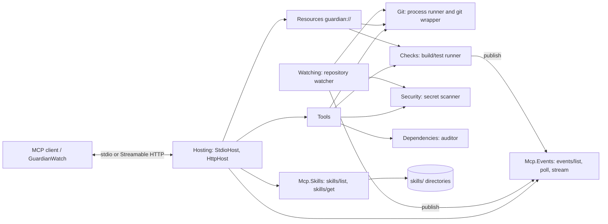

# Proactive Codebase Guardian

> An MCP server that turns AI agents into **reactive and proactive** software engineering assistants.

**Codebase Guardian** watches a Git repository, pushes events the moment something important happens, and gives the agent
structured **Agent Skills** and tools. The agent can then review commits, triage failing checks, respond to leaked secrets and
keep dependencies healthy without constant polling or a human prompting each step.

Every event that has a natural follow-up names a **suggested skill**. A skill is a packaged workflow that the agent loads
(`skills/get` + `resources/read`, verified against a SHA-256 digest) and then carries out with the Guardian's tools.

It is built on the Model Context Protocol `2026-07-28` revision, the MCP C# SDK 2.2.0 and .NET 10:

- **MCP Events**: `events/list`, `events/poll`, and `events/stream` push delivery
- **Skills extension** (`io.modelcontextprotocol/skills`, SEP-2640)
- **Tools** and **Resources**, with the Tasks extension planned for long-running scans
- **Stateless request/response core**: stdio and stateless Streamable HTTP

> **Status:** Epic 1 (the local Guardian) is complete and tested. GitHub integration, webhook delivery and Tasks
> (Epics 2 and 3) are in progress; the [Roadmap](#roadmap) lists what is still planned. The design is in
> [docs/specs/2026-10-04-codebase-guardian-design.md](docs/specs/2026-10-04-codebase-guardian-design.md).

---

## Why this is useful

Traditional AI coding assistants are **reactive**: they act only when a human asks. Engineering teams need assistants that
**notice** problems and start on them.

| Problem | How Codebase Guardian solves it |
|---|---|
| Agents have to keep polling for new commits, failing checks or leaked secrets | **MCP Events**: the server pushes a notification over `events/stream` when something changes. Clients without Events use the `poll_events` tool with the same semantics |
| Complex workflows (security audit, bug triage, dependency upgrades) are hard to prompt reliably | Ships five ready-to-use **Agent Skills** that encode the procedure step by step and name the exact tools and resources to use |
| An event alone does not say what to do next | Each event carries a `suggestedSkill` URI, so the agent knows which workflow to load |
| Skill content could be tampered with in transit | Every skill file is listed with its size and SHA-256 digest, so clients can verify what they load |
| Long-running analysis blocks the conversation | Designed for the **Tasks** extension: long scans will return a handle instead of blocking (planned, Epic 3) |
| Scaling MCP servers used to require sticky sessions | Built on the **stateless `2026-07-28`** protocol: request/response methods need no session affinity |
| Every team reinvents the same "watch this repo" logic | One reusable MCP server that any MCP client can connect to |

**What it does today:**

- When a commit lands, the agent is told (`repo.commit.created`) and can review it with the `pr-review` skill.
- When a commit contains something that looks like a credential, `security.secret_detected` fires with redacted findings, and
  the `security-audit` skill walks through revoke, rotate and clean-up.
- When a dependency manifest changes, the `dependency-hygiene` skill audits for vulnerable and outdated packages.
- When the build or tests fail (`checks.failed`), the `bug-triage` skill reads the stored log, reproduces the failure and
  isolates the commit that caused it.

**Planned (Epic 2):** react to new GitHub issues, PR comments and failed CI runs, and file an issue, comment on a PR or open a
pull request from an already pushed branch. Every outward-facing action asks for confirmation first.

This is the difference between an AI that answers questions and an AI that **helps run the engineering process**.

---

## Features

### Protocol surface

| MCP feature | How the Guardian uses it |
|---|---|
| Tools | Inspect the repository, summarize diffs, run checks, scan for secrets, audit dependencies, `poll_events` fallback |
| Resources | `guardian://` live repo status, recent commits, check runs and logs; `skill://` skill files |
| Skills (`io.modelcontextprotocol/skills`) | `skills/list`, `skills/get`, `resources/directory/read`; five bundled skills |
| Events (Triggers & Events, **draft**) | `events/list`, `events/poll`, `events/stream` |
| Stateless 2026-07-28 core | stdio and stateless Streamable HTTP |

### Bundled skills

| Skill | Use it for | Triggered by |
|---|---|---|
| `guardian` | Load first: what the server watches, how to subscribe, the event-to-skill map, safety rules | — |
| `security-audit` | Triage secret findings by rule, confirm with `scan_secrets`, revoke/rotate first, rewrite history only with consent | `security.secret_detected` |
| `dependency-hygiene` | Run `audit_dependencies`, fix critical/high vulnerabilities first, major vs minor upgrade policy, verify with `run_checks` | `repo.dependencies.changed` |
| `bug-triage` | Read the check log, reproduce, isolate with `recent_commits` and `diff_summary`, classify, write an issue report | `checks.failed` |
| `pr-review` | Review a commit's diff against a checklist covering correctness, tests, security, naming and docs | `repo.commit.created` |

New skills are a directory with a `SKILL.md`; point `--skills-dir` at your own directories to add them.

### Modern MCP support

- Protocol version `2026-07-28`, verified with the official MCP conformance suite: all three Skills scenarios pass (see
  [docs/reference/conformance.md](docs/reference/conformance.md)).
- stdio and stateless Streamable HTTP transports.
- Works with any MCP client, for example Claude Code or VS Code. Clients that do not implement the draft `events/*` methods
  get the same events through the `poll_events` tool.

## Quick start

Requires the .NET SDK 10.0 and `git` on the PATH.

```bash
dotnet build
dotnet run --project src/CodebaseGuardian -- --repo .
```

The server speaks MCP on stdio (stdout is reserved for the protocol; logs go to stderr). Options:

| Option | Meaning |
|---|---|
| `--repo <path>` | Repository to watch (default: current directory) |
| `--transport stdio\|http` | Transport (default `stdio`) |
| `--urls <url>` | HTTP listen address (default `http://127.0.0.1:5199`) |
| `--auto-checks` | Run the configured checks after each new commit |
| `--no-watch` | Disable the repository watcher (no pushed events) |
| `--skills-dir <path>` | Skill directories (default: `skills` next to the binary) |

Every option is also a `Guardian:*` setting (appsettings, `GUARDIAN__*` environment variables).

## Configuring clients

**Claude Code**

```bash
claude mcp add codebase-guardian -- dotnet run --project <path>/src/CodebaseGuardian -- --repo <repo>
```

**VS Code** (`.vscode/mcp.json`)

```json
{
  "servers": {
    "codebase-guardian": {
      "type": "stdio",
      "command": "dotnet",
      "args": ["run", "--project", "<path>/src/CodebaseGuardian", "--", "--repo", "${workspaceFolder}"]
    }
  }
}
```

**HTTP mode** (stateless Streamable HTTP, endpoint `/mcp`)

```bash
dotnet run --project src/CodebaseGuardian -- --transport http --repo . --urls http://127.0.0.1:5199
```

```json
{ "servers": { "codebase-guardian": { "type": "http", "url": "http://127.0.0.1:5199/mcp" } } }
```

## What it offers

Full contract: spec [section 5](docs/specs/2026-10-04-codebase-guardian-design.md).

**Tools**

| Tool | Purpose |
|---|---|
| `repo_status` | Branch, HEAD, ahead/behind, staged/unstaged/untracked files |
| `recent_commits` | Last N commits (default 10, max 100), optional branch |
| `diff_summary` | Per-file stats for a range plus a truncated patch |
| `run_checks` | Run the build/test command, store the log, emit events |
| `scan_secrets` | Scan working tree, staged changes or a commit range; output is redacted |
| `audit_dependencies` | Outdated and vulnerable packages (NuGet and npm) |
| `poll_events` | Fallback for clients without `events/*` |

**Resources**: `guardian://repo/status`, `guardian://repo/commits/recent`, `guardian://checks/latest`,
`guardian://checks/{runId}/log`, and the skill files under `skill://<skill>/<file>`.

**Events**

| Event | Trigger | Suggested skill |
|---|---|---|
| `repo.commit.created` | New commit on a local branch | `pr-review` |
| `repo.branch.changed` | HEAD moved to another branch | none |
| `repo.files.changed` | Working-tree edits (debounced) | none |
| `repo.dependencies.changed` | A dependency manifest changed | `dependency-hygiene` |
| `checks.completed` | A check run finished | none |
| `checks.failed` | A check run failed | `bug-triage` |
| `security.secret_detected` | Secret found in a new commit or scan | `security-audit` |

**Skills**: `guardian` (load first; event-to-skill map), `security-audit`, `dependency-hygiene`, `bug-triage`, `pr-review`.

## Demo client

`samples/GuardianWatch` is a console MCP client that runs the whole loop: it starts the server over stdio, prints the
server instructions, the skill names and the event names, opens one `events/stream` per event (`repo.commit.created`,
`repo.dependencies.changed`, `checks.failed`, `security.secret_detected`, request ids `watch-<name>`), and for every event
with a `suggestedSkill` calls `skills/get`, reads `SKILL.md` with `resources/read`, verifies its SHA-256 digest and size, and
prints `skill <name> verified (<size> bytes)` with the first lines.

```bash
dotnet run --project samples/GuardianWatch -- --repo /path/to/repo
# optional: --server <path to CodebaseGuardian.dll or to the project directory>
```

Then commit something in that repository, for example a fake secret built at runtime (no secret-shaped literal in any file):

```bash
printf 'AWS_ACCESS_KEY_ID=%s%s\n' AKIA IOSFODNN7EXAMPLE > .env.prod && git add -f .env.prod && git commit -m "add env"
```

Ctrl+C sends `notifications/cancelled` for each stream and exits 0. (With SDK 2.2.0 over stdio, cancelling the token of a
request does not reach the server, so the client sends the notification itself; see
[docs/reference/sdk-2.2-notes.md](docs/reference/sdk-2.2-notes.md).)

## Security notes

Spec [section 7](docs/specs/2026-10-04-codebase-guardian-design.md).

- No shell execution: every external process (`git`, `dotnet`, `npm`) runs with an argument list; model-supplied revisions are validated.
- Repo-relative paths are validated against `..` escapes; resource reads resolve only catalog entries and known run ids.
- Secret values are redacted everywhere: tool results, events, logs.
- **HTTP is loopback-only** by default (binds `127.0.0.1`). Binding another address needs `Guardian:HttpAllowRemote=true`, and
  the HTTP transport has **no authentication yet**: anyone who can reach the port can read the repository and run its checks.
- **DNS-rebinding guard**: a request whose `Host` or `Origin` is not loopback is answered with 403 (remote mode drops only the
  `Host` restriction; a non-loopback `Origin` is still refused).

## Limitations

- Events are a **draft** (Triggers & Events working group sketch); the wire format may change.
- State (event log, check runs, watcher cursors) lives in a single process and is lost on restart.
- Dependency auditing covers NuGet and npm only.
- No GitHub tools or events, webhook delivery or Tasks yet (Epics 2 and 3; see [Roadmap](#roadmap)).
- Conformance: the three Skills scenarios of the MCP conformance suite pass; the base 2026-07-28 suite passes everything that does
  not need the suite's own fixtures. Details: [docs/reference/conformance.md](docs/reference/conformance.md).

## Roadmap

| Epic | Delivers | State |
|---|---|---|
| 1. Core Guardian (local) | Git layer, repo tools and resources, Skills, Events (poll/stream), repo watcher, checks, secret scan, dependency audit, stateless HTTP, demo client | **Done** |
| 2. GitHub + webhooks | GitHub client, `create_issue` / `comment_on_pr` / `open_pull_request` with confirmation, `github.issue.opened` / `github.pr.comment.created` / `github.ci.failed` events, HTTP auth, signed webhook delivery via `events/subscribe` | In progress (GitHub REST client done) |
| 3. Tasks | Tasks extension, task-capable `run_checks` and `audit_dependencies`, `full_scan` with a report resource | Planned |

Non-goals for v1: shared state across instances, ecosystems beyond NuGet and npm, auto-fixing code or pushing commits.
The agent makes changes with its own tools; the Guardian only opens PRs from branches that already exist on the remote.

## Architecture



`Mcp.Skills` and `Mcp.Events` are generic libraries that never reference the application.

## Development

```bash
dotnet test        # xunit.v3; no network needed, git tests use real temporary repositories
```

```
src/Mcp.Skills        Skills extension library
src/Mcp.Events        Events extension library
src/CodebaseGuardian  the server (Hosting, Git, Watching, Checks, Security, Dependencies, Tools, Resources, skills)
samples/GuardianWatch demo client
tests/                CodebaseGuardian.Tests (includes the end-to-end scenario test)
docs/                 spec, backlog, reference notes
```

## License

[MIT](LICENSE) © 2026 Islam Umarov. The bundled skills are also MIT-licensed (`license: "MIT"` in each `SKILL.md`).
